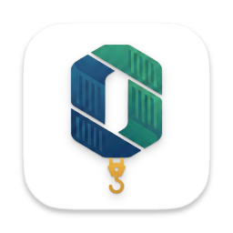

<div align="center">



# Opentainer

**An ultra-lightweight, high-performance desktop container management application**

[](LICENSE)
[](https://tauri.app)
[](https://react.dev)
[](https://www.rust-lang.org)

[Why Opentainer?](#-why-opentainer) • [Features](#-features) • [Installation](#-installation) • [Contributing](#-contributing)

</div>


## ✨ Features

- **⚡ Ultra-Lightweight** - Tiny ~7MB binary with minimal CPU/RAM footprint
- **📦 Container Management** - Start, stop, restart, and remove containers with ease
- **🖥️ Interactive Terminal** - Built-in shell access to running containers
- **📜 Live Logs** - Real-time log streaming with search functionality
- **🖼️ Image Management** - Pull, list, and remove Docker images
- **� Volume & Network Management** - Full control over Docker resources
- **�📊 Resource Monitoring** - Live CPU and memory usage statistics
- **🎨 Modern UI** - Beautiful, responsive interface with smooth animations
- **🔋 Battery Efficient** - Doesn't drain your laptop's battery like heavy managers

## 📸 Screenshots

<!-- Add your screenshots to the assets/ folder and reference them here -->
<!-- Example:  -->
*Screenshots coming soon*

## 📥 Installation

### Download

Download the latest release for your platform from the [Releases](https://github.com/zahidcakici/opentainer/releases) page:

| Platform | Download |
|----------|----------|
| macOS (Universal) | `.dmg` |
| Windows | `.msi` / `.exe` |
| Linux | `.AppImage` / `.deb` |

### Requirements

- **Docker** must be installed and running on your system
- macOS 10.15+, Windows 10+, or Linux (Ubuntu 20.04+)

## 🛠️ Development

### Prerequisites

- [Node.js](https://nodejs.org/) 24+
- [Rust](https://www.rust-lang.org/tools/install) 1.90+
- [Docker](https://www.docker.com/get-started)

### Setup

```bash
# Clone the repository
git clone https://github.com/zahidcakici/opentainer.git
cd opentainer

# Install dependencies
npm install

# Run in development mode
npm run dev
```

### Available Scripts

| Command | Description |
|---------|-------------|
| `npm run dev` | Start development server with hot reload |
| `npm run build` | Build for production |
| `npm run lint` | Run ESLint |
| `npm run type-check` | Run TypeScript type checking |
| `npm run test` | Run tests |

### Project Structure

```
opentainer/
├── src/                 # React frontend
│   ├── components/      # UI components
│   ├── hooks/           # Custom React hooks
│   └── lib/             # Utilities and API
├── src-tauri/           # Rust backend
│   ├── src/             # Rust source code
│   └── icons/           # Application icons
└── public/              # Static assets
```

## 🏗️ Tech Stack

- **Frontend**: React 19, TypeScript, Framer Motion
- **Backend**: Rust, Tauri 2, Bollard (Docker API)
- **Build**: Vite, Cargo
- **Testing**: Vitest, Testing Library

## 🤝 Contributing

Contributions are welcome! Please read our [Contributing Guide](CONTRIBUTING.md) for details on our code of conduct and the process for submitting pull requests.

## 📄 License

This project is licensed under the MIT License - see the [LICENSE](LICENSE) file for details.

## 🙏 Acknowledgments

- [Tauri](https://tauri.app/) - For the amazing desktop framework
- [Bollard](https://github.com/fussybeaver/bollard) - For the Docker API client
- [Lucide](https://lucide.dev/) - For the beautiful icons

---

<div align="center">
Made with ❤️ by <a href="https://github.com/zahidcakici">Zahid Cakici</a>
</div>
