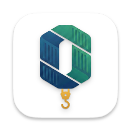
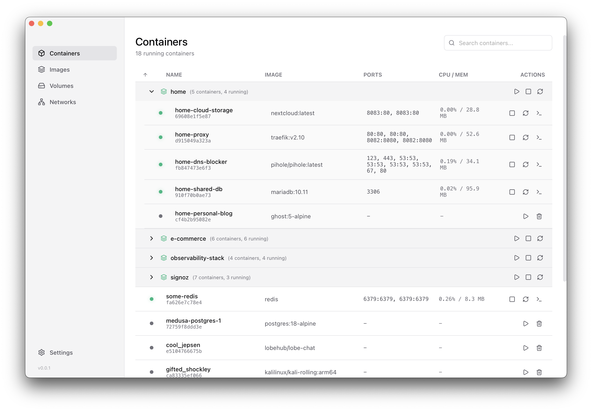
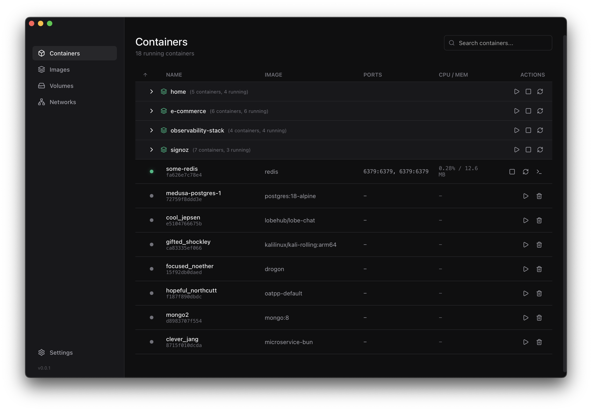
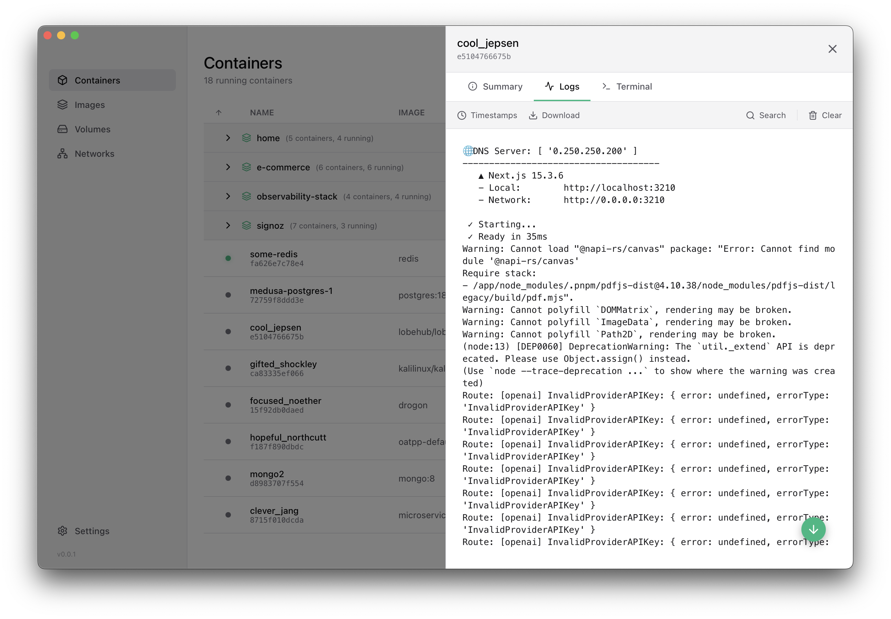

<div align="center">



# Opentainer

**An ultra-lightweight, high-performance desktop container management application**

[](LICENSE)
[](https://tauri.app)
[](https://react.dev)
[](https://www.rust-lang.org)

[Why Opentainer?](#-why-opentainer) • [Features](#-features) • [Installation](#-installation) • [Contributing](#-contributing)

</div>


## ✨ Features

- **⚡ Ultra-Lightweight** - Tiny ~7MB binary with minimal CPU/RAM footprint
- **🐳 Standalone Docker Engine** - Can run as a complete Docker Desktop alternative using Colima (on macOS)
- **📦 Container Management** - Start, stop, restart, and remove containers with ease
- **🖥️ Interactive Terminal** - Built-in shell access to running containers
- **📜 Live Logs** - Real-time log streaming with search functionality
- **🖼️ Image Management** - Pull, list, and remove Docker images
- **💾 Volume & Network Management** - Full control over Docker resources
- **📊 Resource Monitoring** - Live CPU and memory usage statistics
- **🎨 Modern UI** - Beautiful, responsive interface with smooth animations
- **🔋 Battery Efficient** - Doesn't drain your laptop's battery like heavy managers

## 📸 Screenshots

<div align="center">





</div>

## 📥 Installation

### Download

Download the latest release for your platform from the [Releases](https://github.com/zahidcakici/opentainer/releases) page:

| Platform | Download |
|----------|----------|
| macOS (Universal) | `.dmg` |
| Windows | `.msi` / `.exe` |
| Linux | `.AppImage` / `.deb` |

### Requirements
 
 - **Docker** must be installed and running on your system, OR:
 - **Colima** (macOS) - Opentainer can automatically manage the Colima runtime for you.
 - macOS 10.15+, Windows 10+, or Linux (Ubuntu 20.04+)
 
 ### 🐳 Standalone Mode (macOS)
 
 Opentainer can replace Docker Desktop entirely on macOS. It automatically detects your environment:
 
 1. **Existing Docker**: If you have Docker Desktop, OrbStack, or Podman running, Opentainer connects to it automatically.
 2. **Standalone**: If no Docker is running, Opentainer runs its **own bundled Colima + Lima engine** — no Homebrew, no terminal, no prerequisites. On first launch a short setup wizard lets you pick your engine and resources; the only one-time wait is the Colima VM image download.
 
 Standalone mode uses Apple's Virtualization framework and requires **macOS 13 (Ventura) or newer**.

## 🛠️ Development

### Prerequisites

- [Node.js](https://nodejs.org/) 24+
- [Rust](https://www.rust-lang.org/tools/install) 1.90+
- [Docker](https://www.docker.com/get-started)
- [`jq`](https://jqlang.github.io/jq/) — only needed to fetch/update the bundled macOS engine (`brew install jq`)

### Setup

```bash
# Clone the repository
git clone https://github.com/zahidcakici/opentainer.git
cd opentainer

# Install dependencies
npm install

# Run in development mode
npm run dev
```

### Available Scripts

| Command | Description |
|---------|-------------|
| `npm run dev` | Start development server with hot reload |
| `npm run build` | Build for production |
| `npm run lint` | Run ESLint |
| `npm run type-check` | Run TypeScript type checking |
| `npm run test` | Run tests |
| `npm run engine:fetch` | Download + verify the bundled macOS engine (Colima + Lima) into `src-tauri/resources/engine/` |
| `npm run engine:lock` | Regenerate `engine.lock.json` (resolved URLs + checksums) from `engine.manifest.json` |

### Bundled container engine (macOS)

On macOS, Opentainer ships its own Colima + Lima engine so a fresh Mac can run
containers with zero prerequisites. The binaries themselves are **not** committed
— they're downloaded at build time and pinned across two files (the same
`manifest` + `lock` split as `package.json` / `package-lock.json`):

- [`engine.manifest.json`](engine.manifest.json) — **intent**, hand-edited: each
  component's `version` + source URL. This is the only file you edit to upgrade.
- [`engine.lock.json`](engine.lock.json) — **generated**, never hand-edited:
  resolved per-arch URLs + SHA256 checksums.

```bash
# Fetch the engine for your architecture into src-tauri/resources/engine/
# (verified against engine.lock.json). Needed before `npm run build` on macOS.
npm run engine:fetch                 # host arch
npm run engine:fetch -- x86_64       # cross-fetch a specific arch (arm64 | x86_64)
```

`npm run dev` works **without** fetching: if the bundled engine is absent, the
backend falls back to a system-installed `colima`/`limactl` (e.g. via Homebrew).
Fetch the engine when you want to exercise the real bundled setup.

**Upgrading the pinned engine** — bump the version, then relock:

```bash
# 1. edit engine.manifest.json  ->  bump colima/lima "version"   (only manual step)
# 2. regenerate checksums from the real artifacts:
npm run engine:lock
# 3. pull the new binaries, then commit engine.manifest.json + engine.lock.json:
npm run engine:fetch
```

`engine:lock` downloads each artifact for every arch, hashes the actual bytes,
and rewrites `engine.lock.json` — you never compute or paste a checksum. Review
the diff (ideally cross-check against the upstream projects' published release
checksums) before committing. `npm run engine:lock -- --check` verifies (offline)
that the lock is in sync with the manifest; CI runs it to block a stale lock. The
`engine:fetch` step and the release build also refuse to run against a stale lock.

> Lima's `vz` driver runs the guest VM in-process, so `limactl` must be signed
> with the `com.apple.security.virtualization` entitlement
> ([`src-tauri/resources/lima-vz.entitlements`](src-tauri/resources/lima-vz.entitlements)).
> `engine:fetch` ad-hoc-signs it for local dev; the release pipeline re-signs it
> with the Developer ID before notarization.

### Project Structure

```
opentainer/
├── src/                 # React frontend
│   ├── components/      # UI components
│   ├── hooks/           # Custom React hooks
│   └── lib/             # Utilities and API
├── src-tauri/           # Rust backend
│   ├── src/             # Rust source code
│   └── icons/           # Application icons
└── public/              # Static assets
```

## 🏗️ Tech Stack

- **Frontend**: React 19, TypeScript, Framer Motion
- **Backend**: Rust, Tauri 2, Bollard (Docker API)
- **Build**: Vite, Cargo
- **Testing**: Vitest, Testing Library

## 🤝 Contributing

Contributions are welcome! Please read our [Contributing Guide](CONTRIBUTING.md) for details on our code of conduct and the process for submitting pull requests.

## 📄 License

This project is licensed under the MIT License - see the [LICENSE](LICENSE) file for details.

## 🙏 Acknowledgments

- [Tauri](https://tauri.app/) - For the amazing desktop framework
- [Bollard](https://github.com/fussybeaver/bollard) - For the Docker API client
- [Lucide](https://lucide.dev/) - For the beautiful icons

---

<div align="center">
Made with ❤️ by <a href="https://github.com/zahidcakici">Zahid Cakici</a>
</div>
